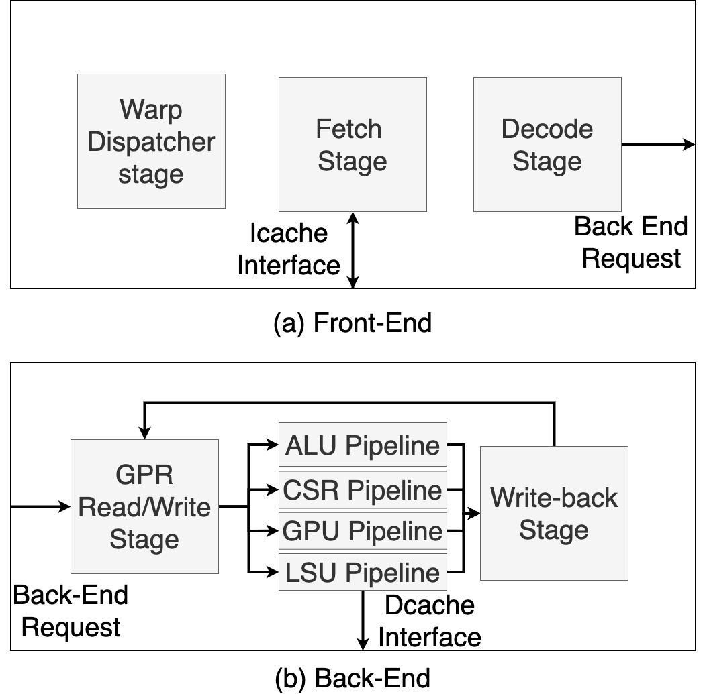

## Welcome
Vortex is a parameterizable and synthesizable open-source RISC-V GPGPU written in Verilog. 
## Document Purpose
The purpose of this document is to describe the design and implementation of the core as well as provide other useful information on using the core. 
## Useful Links
Source code. [Most recent publication](https://arxiv.org/pdf/2002.12151.pdf)
## Quick Start
```
code goes here
```
# Introduction
## Vortex Core Overview


The Vortex System implements a SIMT architecture with a minimal RISC-V ISA extension on top of the RISC-V 32 bit integer and multiple extensions (RV32IM) that implements the execution of OpenCL programs. 

Below is a detailed description of the new ISA extension. 
- **Wspawn** - spawn new warps at pc
- **Tmc** - change thread mask to activate threads
- **Spilt** - control flow divergence
- **Join** - control flow reconvergence
- **Bar** - hardware warps barrier

The Vortex pipeline is split into four main modules: front_end(), back_end(), scheduler(), and dmem_controller(). The Front-End of the vortex core includes the Fetch and Decode stages and pipeline registers. The Back-End consists of a stage to read data from the general-purpose registers (GPRs), a Execute stage including pipelines for the ALU, Control-Status registers, GPU control, and Load-Store unit. Finally, the Back-end of the pipeline includes logic for the writeback stage. Between the front and back-end of the pipeline there is a scheduler module that manages the request from the front to the back end of the pipeline. 
# Core Overview
## Fetch 
During the fetch stage the warp scheduler module is called to decide which warp will be executed during the current cycle. 
### Warp Scheduler
The warp scheduler consists of two components: four warp masks that choose which warp to schedule next and a warp table that contains private information for each warp. 

The warp masks are detailed as follows:
1) active warps, one bit indicating whether a warp is active or not
2) stalled warp mask, indicates which warps are currently being stalled by memory requests
3) barrier warps mask, indicates which warps are stalled because of a barrier instruction
4) visible warps mask, supports a hierarchical scheduling policy

Each cycle, the scheduler selects one warp from the visible warp mask and invalidates that warp. When the visible warp mask is zero the active mask is refilled by checking which warps are currently active and not stalled. Warps will stay in the active mask until they set their thread mask’s value to zero, or warp zero utilizes wspawn. 
Thread Mask and the IPDOM Stack
Thread mask register (Where is this at? I think the GPU stage) determines which threads are active. If a bit in the mask is zero no changes are made to the threads register file and no changes are made to the cache based on that thread. 

The IPDOM (Immediate Post Dominator) stack, contained within the warp scheduler module,  handles control divergence. The IPDOM stack is controlled by split and join instructions, thereby monitoring control divergence within the Vortex core. 

When there is divergence three things happen. First, the current thread mask is pushed to the stack. Second, active threads that evaluate as false are put onto the stack with PC+4. Third, the current thread mask is updated to reflect threads with predicates equal to true. 
An entry to the IPDOM becomes fall-through when it is necessary to keep the thread mask but not the PC from the entry. 

Warp barriers (is this also handled in the GPU pipeline?) 

## I-Cache Interface
The I-Cache stage retrieves the next instruction from the I-cache once the current warp is determined.  
## Decode
Decodes the current instruction and passes the back end request through the back end request interface. 
## Scheduler
## GPR Read/Write Stage
Warp context
Contains the general-purpose registers for each thread in the warp
Each hardware warp is assigned a warp context
Handles clone and wspawn instructions
## Execute Pipelines
### ALU
ALU now includes a pipeline for Divide and Multiply instructions (Floating Point) 
### CSR
I have no idea what this does
RISC-V specifies four hardware privilege levels that are specified by the 
### GPU
I think this is where the control divergence stuff is actually handled
### LSU

