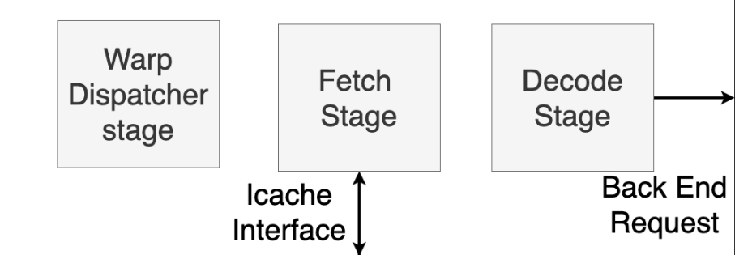

# Welcome
Vortex is a parameterizable and synthesizable open-source RISC-V GPGPU written in Verilog. 
## Document Purpose
The purpose of this document is to describe the design and implementation of the core, as well as to provide other useful information on using the core. 
## Useful Links
- [Most recent publication](https://arxiv.org/pdf/2002.12151.pdf)
- [High Performance Computer Architecture Lab](http://comparch.gatech.edu/hparch/index.html)

# Introduction
## Vortex Core Overview

The Vortex System implements an SIMT architecture with a minimal RISC-V ISA extension on top of the RISC-V 32 bit integer and multiple extensions (RV32IM) that implement the execution of OpenCL programs. 

Below is a detailed description of the new ISA extension. 
- ```wspawn``` - spawn new warps at pc
- ```tmc``` - change thread mask to activate threads
- ```spilt``` - control flow divergence
- ```join``` - control flow reconvergence
- ```bar``` - hardware warps barrier

The Vortex pipeline is split into four main modules: _front_end()_, _back_end()_, _scheduler()_, and _dmem_controller()_. The Front-End of the Vortex core includes the Fetch, I-Cache, and Decode stages and corresponding pipeline registers. The Back-End consists of a stage to read data from the general-purpose registers (GPRs), an Execute stage including pipelines for the ALU, control-status register (CSR) instructions, warp and thread-mask control, and the load-store unit. Finally, the Back-End of the pipeline includes logic for the Writeback stage. Between the Front and Back-End of the pipeline, there is a Scheduler module that manages the request from the front to the back end of the pipeline. 
# Core Overview

## Fetch 
During the Fetch stage, the Warp Dispatch module is called to decide which warp will be executed during the next cycle. 
### Warp Dispatch
The Warp Dispatch stage consists of two components: a group of four warp masks that choose which warp to schedule next and a warp table that contains private information for each warp. 

The warp masks are detailed as follows:
1) active warps, with one bit indicating whether a warp is active or not
2) stalled warp mask, indicates which warps are currently being stalled by memory requests
3) barrier warps mask, indicates which warps are stalled because of a barrier instruction
4) visible warps mask, supports a hierarchical scheduling policy

Each cycle, dispatch selects one warp from the visible warp mask and invalidates that warp. When the visible warp mask is zero, the active mask is refilled by checking which warps are currently active and not stalled. Warps will stay in the active mask until they set their thread mask’s value to zero, or warp zero utilizes wspawn. 

### Thread Masks and the IPDOM Stack
The thread mask register determines which threads are active. If a bit in the mask is zero, no changes are made to the threads' register file, and no changes are made to the cache based on that thread. 

The IPDOM (Immediate Post Dominator) stack, contained within the warp dispatch module,  handles control divergence. 

The IPDOM stack is controlled by ```split``` and ```join``` instructions. When there is divergence in the execution of threads within a warp, three things happen. First, the current thread mask is pushed to the IPDOM stack. Second, active threads that evaluate a predicate as false are put onto the stack with PC+4. Third, the current thread mask is updated to reflect threads with predicates equal to true. 

An entry to the IPDOM becomes fall-through when it is necessary to keep the thread mask but not the PC from the entry. 

## Warp barriers

## I-Cache Interface
The I-Cache stage retrieves the next instruction from the instruction cache once the next warp is determined.  
## Decode
The Decode stage decodes the current instruction and passes a back-end request to the Scheduler stage. 
## Scheduler
The Scheduler stage stalls a back-end request if there are conflicts in the registers that need to be accessed. The Scheduler instantiates a rename table that tracks the lock status of each GPR in the core. A register will be locked if a prior instruction is writing to it in the same cycle. Registers are locked during the Writeback stage. In order for a back-end request to be processed, none of the source registers must be locked. 

## GPR Read/Write Stage
Warp Context
- Contains the general-purpose registers for each thread in the warp
- Each hardware warp is assigned a warp context
- Handles clone and wspawn instructions

## Execute Pipelines

The Execute stage consists of four execution units: an ALU pipeline with support for floating-point instructions, a Control-Status Register (CSR) unit, a GPU unit, and the Load-Store unit. 

### CSR 
RISC-V specifies control-status registers that are separate from the general purpose register file. Control-status registers can be used to store high-level information about the core, such as cycle count and current status of the core. Each CSR has an associated privilege, each of which is defined by the RISC-V specification. 

### GPU
The GPU unit handles the execution of the ```wspawn``` and ```tmc``` instructions by updating the active thread mask or the active warp mask reference in the warp dispatch stage. 

### LSU
D-Cache Interface 

## Writeback
The Writeback stage manages updates to the general-purpose register file. During the Writeback stage, destination registers are locked within the rename table to prevent any write-after-read or write-after-write data dependencies between two instructions. 

# Memory
All Vortex memory modules build on a general banked, set-associative cache model. 

## D-Cache
- Configurable by size, number of ways, and line sizes
- Only one thread can access the cache module per cycle
- In a 32 threads per warp configuration, a memory instruction would take 32 cycles in MEM stage

## Shared Memory
- Banked by the number of threads in a configuration
- Mapped to a physical address space and managed by the kernel
- In a 32 threads per warp configuration, a memory instruction could take only 1 cycle if there are no bank conflicts

# Terminology
- _Hardware Warp_: group of threads that share the same program counter and follow the same execution path with minimal divergence.  Fetching, decoding, and issuing of instructions is done within the same warp. 
- _Hardware Thread_ (also referred to as hart): Each thread has its own set of general purpose registers. The width of the ALU is equal to the number of threads.


